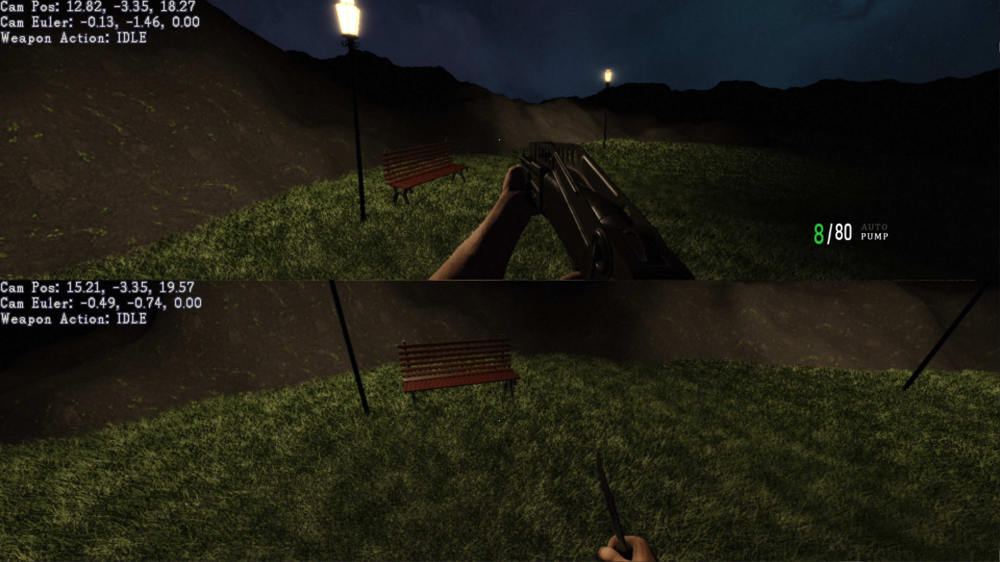

# OpenGL Depth Peeled Hair



The current working project for the rewrite of Hell Engine. At some point soon I'm gonna push this over the top of Hell2025.

```
git clone https://github.com/livinamuk/VKSandbox.git
```

Controls

```
WSAD:      walk
CTRL:      duck
SPACE:     jump
L MOUSE:   fire 
R MOUSE:   toggle auto shotty
Q:         next weapon
V:         next splitscreen mode
F:         toggle fullscreen
1/2/3/4:   switch player
```

Never quit, never waver 🌹
